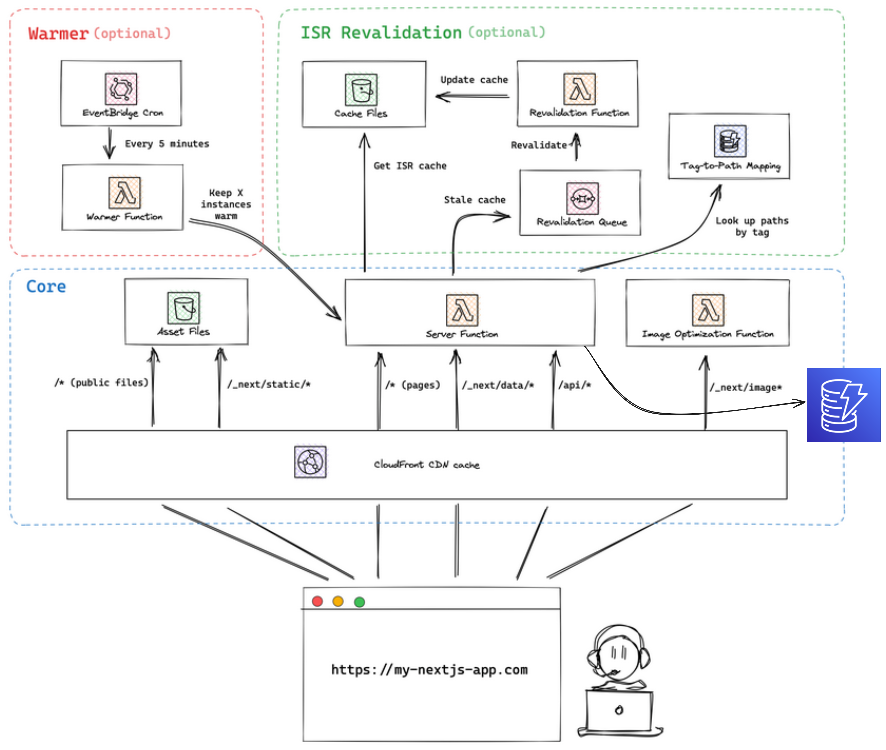

# Developer Notes

The app is developed using NextJS as a main framework following the BBF pattern, there is only one Server Function that handles the logic and communication with TheMovieDb API. The app is deployed to AWS using [SST](https://docs.sst.dev/constructs/NextjsSite) which uses [OpenNext](https://open-next.js.org/).

For styles we are using Tailwind and [Chadcn UI](https://ui.shadcn.com/). The deployment is handle using GitHub Actions.

### Why choose SST for deployment?

1. Its easier to handle AWS resources, SST use AWS CDK (Cloud Development Kit) so the same can be achieve by doing plain CDK, but for the sake of the Demo and to avoid boilerplate code SST was the best option.
2. Another options is to deploy all NextJS app to Vercel, which overall offers a better developer experience, but still we need to handle a DB connection, arguably, we could have a dedicated backend in AWS with a DynamoDB table and a Lambda with API Gateway, but for simplify the code organizations we used Server Functions from NextJS only.

### Why choose AWS for infrastructure? 

Another option is to have the app deployed in Vercel and use a Serverless Database like [PlanetScale](https://planetscale.com/) but generally speaking AWS offer more control over the resources uses and its more suitable for enterprise applications.

### SST/AWS Architecture



### Disclosure/Future improvements

- Ideally a cache layer should be between the front and back, this could be in a NextJS context (if using Vercel), on the CloudFront distribution, API Gateway or even in DynamoDB (as pointed out in `sst.config.ts` in the commented code). 
- Persisting a cache counter in the DB its not a good idea for this GET request, but its understandable for the goal of the demo.
- To improve performance and reduce GET latency, we could introduce an AWS SQS queue to publish results from TheMovieDb API or DB hits, having another lambda to be responsible of updating the cache counter (although this could introduce other challenges in how to handle race conditions, adding retry logic, and eventual consistency) following the Single Responsibility pattern.
- The folder structure is highly improvable, ideally if the business logic increase we should have a clear separation of concerns between the FrontEnd, BFF, and Backend, introducing Services and Repositories, and other possible microservices, grouping them by Context Domain.
- All the logic of the backend is within the same file (with the exception of the Data Layer `data-access`), validators and services should have their own folders.
- Overall the front and back are "trusting" the response, ideally we should always validate the input/output using something like Zod or even TRPC (taking advantage of NextJS).
- The single React Context can be design differently.
- The pagination, specially the `MoviesContainer.tsc`, may have weird use of variables and itemsPerPage, initially it was design assuming that the TheMovieDb API will return all matches with the given criteria, letting the responsibility of pagination to DynamoDB (using LastEvaluateKey if using Query command of AWS SDK v3) or the frontend, assuming it received all items and its frontend. On the testing phase I noticed that the TheMovieDb API already have pagination and returns 20 items per page, same number as our frontend pagination, that is why some logic may be assuming that it will always be like that but its something that needs to be handle.
- The DynamoDB schema and how we store records its improvable, we are assuming that our record is no heavier than [400 KB](https://docs.aws.amazon.com/amazondynamodb/latest/developerguide/bp-use-s3-too.html), which is our case, but arguably we need to design a better way to store movies and use QueryCommand instead of GetCommand.
- All possible code improvement are listed with `// TODO: ...`.

### File structure

```
movies-search
├─ .github
│  └─ workflows
│     └─ deploy_to_qa.yml...(Github Actions CI/CD process)
├─ src
│  ├─ components
│  │  └─ ui_________________(Chadcn UI components)
│  │     ├─ badge.tsx
│  │     ├─ button.tsx
│  │     ├─ card.tsx
│  │     ├─ input.tsx
│  │     ├─ label.tsx
│  │     ├─ pagination.tsx
│  │     ├─ scroll-area.tsx
│  │     ├─ separator.tsx
│  │     └─ skeleton.tsx
│  ├─ context________________(React contexts)
│  │  └─ MovieContext.tsx____(Main and single context use in the app)
│  ├─ data-access____________(Data Access Layer for our DB, used only for our Server function)
│  │  ├─ dynamoDBClient.ts___(AWS SDK v3 client)
│  │  ├─ interface.tst_______(Contract of our repository to be consume by services/handler)
│  │  └─ repository.t________(Repository implementation)
│  ├─ movies_________________(Movies UI components grouped by domain)
│  │  ├─ CacheCounter.tsx____(List the number of times we hit our DB cache)
│  │  ├─ InputWithLabel.tsx__(Input for movies search criteria)
│  │  ├─ MovieCard.tsx_______(Movie Card)
│  │  ├─ MovieSkeleton.tsx___(Component to render while Server functions returns movie dataset)
│  │  └─ MoviesContainer.tsx_(Movie container)
│  ├─ pages
│  │  ├─ _app.tsx
│  │  └─ api
│  │      └─ list_movies.ts__(Server function/handler, AWS Lambda)
│  └─ types
│     ├─ Movie.ts
│     └─ TheMovieDB.ts
└─ sst.config.ts_____________(Iac holding all AWS Resources as SST configuration)
```
